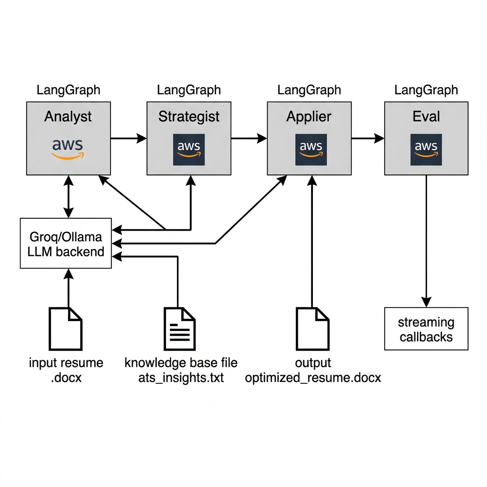

# ATS Optimizer

[](https://github.com/rohanot/ats-happy/actions/workflows/ci.yml)  
[](https://opensource.org/licenses/MIT)

A lightweight, agentic **Applicant Tracking System (ATS) Optimizer** built with **LangGraph** and **LangChain**. It iteratively evaluates a resume, generates rewrite suggestions, applies them, and self‑evaluates—all in a single, reproducible pipeline.

## Architecture


## Low‑Level Design (LLD)



## Features
- Multi‑agent workflow (Analyst → Strategist → Applier → Eval)
- Dual‑engine support: local Ollama **or** cloud Groq (free tier)
- Real‑time streaming output for full visibility into LLM reasoning
- Persistent knowledge base (`ats_insights.txt`) that learns from each run
- Fully container‑friendly and easy to integrate into CI/CD

## Installation

```powershell
# Clone the repository (once it is pushed)
git clone https://github.com/rohanot/ats-happy.git
cd ats-happy

# Create a virtual environment
python -m venv .venv
.\.venv\Scripts\Activate.ps1   # PowerShell
# or source .venv/bin/activate on Linux/macOS

# Install dependencies
pip install -r requirements.txt
```

## API Keys
Create a `.env` file in the project root and add the required keys:

```env
# Groq (recommended, free tier)
GROQ_API_KEY=your_groq_key_here

# Optional – Gemini (if you ever switch back)
GEMINI_API_KEY=your_gemini_key_here
```

> **Never** commit `.env` to the repository – the `.gitignore` protects it.

## Usage

```powershell
# General ATS optimization (no specific JD)
python graph_ats.py <your_resume.docx> --engine groq --model qwen/qwen3-32b

# If you have a JD file, include it:
python graph_ats.py <your_resume.docx> --jd <job_description.txt> --engine groq --model qwen/qwen3-32b
```

The script will:
1. Load the resume (and JD if provided)
2. Run the LangGraph state machine
3. Output an optimized `optimized_resume.docx`
4. Log a short evaluation report to the console and append any lessons learned to `ats_insights.txt`

## Contribution Guidelines
1. Fork the repository.
2. Create a feature branch (`git checkout -b my-feature`).
3. Make your changes and ensure the CI workflow passes (`git push` will trigger it).
4. Open a Pull Request describing your changes.
5. Ensure you do **not** add any secret files (`.env`, `.venv/`).

## License

MIT License – see the `LICENSE` file for details.
